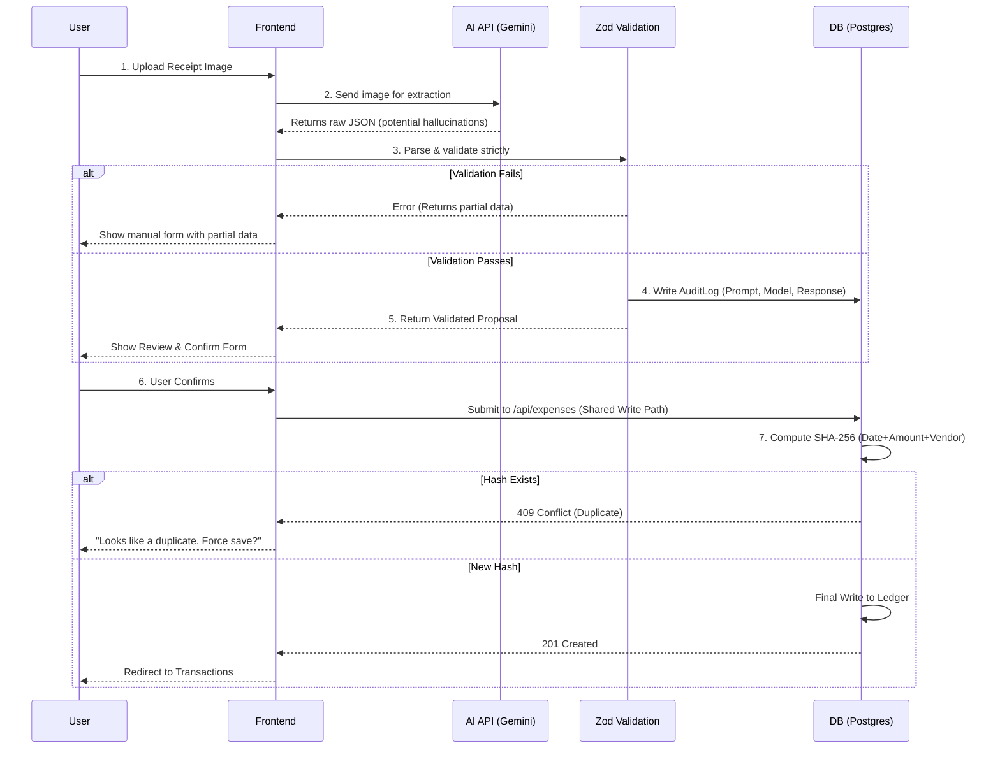

# ExpenseIQ — AI Financial Guardrail 💳✨

ExpenseIQ is a production-grade, full-stack expense tracker that uses **Google Gemini** for rapid receipt parsing, wrapped in a strict **deterministic guardrail architecture**. 

Unlike naive AI wrappers that directly pipe LLM output to a database, ExpenseIQ strictly enforces the principle of **"AI proposes, deterministic code decides."**

 <!-- Replace with actual screenshot -->

## 🌍 Live Demo
- **Frontend (Vercel):** [https://expense-iq-beige.vercel.app](https://expense-iq-beige.vercel.app)
- **Backend (Render):** `https://expense-iq-387i.onrender.com`

> **Note on Cold Starts:** The backend is deployed on Render's free tier. If the service hasn't been used in 15 minutes, it will spin down. The first request (like logging in or scanning a receipt) might take 30-50 seconds to wake the server up. Subsequent requests will be lightning fast!
## 🚀 The Architecture: "AI Proposes, Code Decides"

The core engineering challenge with LLMs is their non-deterministic nature (hallucinations, formatting failures). ExpenseIQ solves this by sandboxing the AI extraction from the actual database writes.



### The 7-Step Guardrail Pipeline

1. **Ingestion:** Receipt image is uploaded via Next.js to the Express backend (`POST /api/expenses/scan`).
2. **Extraction:** The image is sent to Google Gemini (`gemini-3.5-flash`) for vision-based JSON extraction.
3. **Zod Validation:** The AI's response is strictly validated against a deterministic Zod schema. Extra fields are stripped; missing required fields trigger an immediate `400 Bad Request`.
4. **Audit Logging:** An `AuditLog` is created in Postgres, recording the exact raw prompt, AI response, model used, and latency—crucial for debugging hallucinations.
5. **Human-in-the-Loop:** The validated JSON is sent *back* to the frontend as a "proposal." **Nothing is written to the main ledger yet.**
6. **Deduplication Check:** When the user confirms the proposal, the payload hits the shared `createExpense()` write path. A deterministic SHA-256 hash (Date + Amount + Vendor) is generated. If a duplicate exists, it rejects the write (unless explicitly overridden with `force: true`).
7. **The Final Write:** Only after all deterministic validations pass does the transaction hit the PostgreSQL ledger.

## 🛠️ Tech Stack

**Frontend**
- **Framework:** Next.js 15 (App Router)
- **Styling:** Tailwind CSS v4 (Glassmorphism, Dark Mode)
- **Charts:** Recharts
- **Icons:** Lucide React

**Backend & AI**
- **API:** Node.js / Express
- **Database:** PostgreSQL via Prisma ORM
- **AI Provider:** Google Gemini (Vision + Text, `gemini-3.5-flash`)
- **Caching & Rate Limiting:** Redis (via ioredis)
- **Validation:** Zod

## ⚙️ Getting Started

### Prerequisites
- Node.js (v18+)
- PostgreSQL
- Redis
- A [Gemini API Key](https://aistudio.google.com/)

### 1. Backend Setup

```bash
cd backend
npm install
```

Copy the environment file and fill in your keys:
```bash
cp .env.example .env
```
Ensure you set your `DATABASE_URL`, `REDIS_URL`, `JWT_SECRET`, and `GEMINI_API_KEY`.

Run the database migrations:
```bash
npx prisma db push
```

Start the backend:
```bash
npm run dev
# The API will be available at http://localhost:5000
```

### 2. Frontend Setup

```bash
cd frontend
npm install
npm run dev
# The UI will be available at http://localhost:3000
```

## 🛡️ Key Features

- **Bulletproof Deduplication:** A SHA-256 hashing algorithm prevents accidental double-uploads of the same receipt, regardless of whether it was manually entered or AI-scanned.
- **Budget Threshold Alerts:** A background job evaluates spending against category budgets and triggers alerts at 50%, 90%, and 100% capacity.
- **AI Narrative Summaries:** Gemini analyzes monthly spending and generates a human-readable financial insight paragraph, strictly confined to read-only views.
- **Redis Rate Limiting:** The expensive AI endpoints are protected by custom Redis rate-limiters (e.g., 10 scans/hour) with in-memory fallbacks for local development.
- **Multi-Stage Dockerization:** The backend is fully containerized with a highly optimized Alpine-based runner, ready for immediate deployment on Render or AWS.

## 📄 License
MIT License
